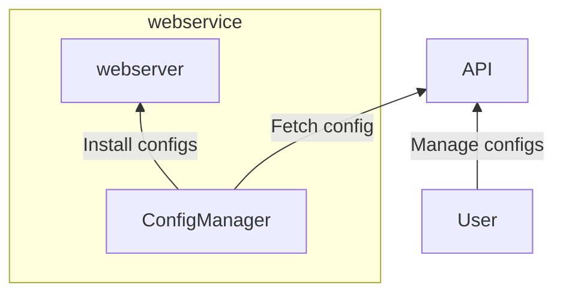

# Mentoril

Essa aplicação é um estudo de caso do Mentoril que acontece no Ubatuba's server.

A ideia é estudar go e construir um sistema um pouco diferente do comum, saindo um pouco de APIs de CRUD com poucas regras de negócio.

## O que é?

A aplicação tem como objetivo gerenciar configurações de um webserver existente que roda em servidores em um cluster. Cada instância roda uma cópia dessa aplicação.

Para configurar esse webserver, precisamos coletar informações de uma API externa ao webserver.

O webserver conta com uma API usada para instalar, atualizar, listar e deletar essas configurações.




## Sobre o webservice

### Webserver

Vamos criar um webserver básico apenas para fim de demonstrar como aplicar as configurações.

Esse webserver tem duas principais features:
* Controlar o tempo de cache dos objetos
* Controlar redirects dinâmicos

O webserver tem uma API para a criação, atualização, remoção e listagem das configurações.

```
GET /configs
GET /configs/<id>
POST /configs
DELETE /configs/<id>
```

### ConfigManager

O ConfigManager precisa atualizar as configurações sempre que uma configuração é atualizada, criada, removida, etc.

Os dados devem ser sincronizados com a API de configurações.

## Sobre a API de configurações

A API de configurações é o ponto de gerência das configurações do webserver mais focado em clientes.

Clientes precisam modificar o tempo de cache de uma imagem, por exemplo, pra isso elas precisam poder alterar esse valor em uma aplicação, a nossa API de configurações.

O webserver deve atualizar após a configuração for salva, ou removida. Uma ação na API de configuração implica em uma mudança no webserver.

### Configurando cache

Clientes podem escolher para uma _rota_ um _tempo de expiração_ ou um _redirect_, por exemplo.

```json
{
  "path": "/images/.jpg*",
  "expire_in": 600,
  "redirect_to": ""
}
```

## Requisitos

* O webserver deve estar sempre com a configuração mais atualizada
* O webserver precisa subir com as configurações instaladas e atualizadas
    * Caso uma instância caia, ela precisa voltar com as configurações corretas
    * Caso o número de instâncias do webserver escale (de 5 instâncias pra 6, por exemplo), a instância nova precisa subir com as configurações corretas
* As aplicações precisam ter métricas:
    * Latência
    * Disponibilidade
